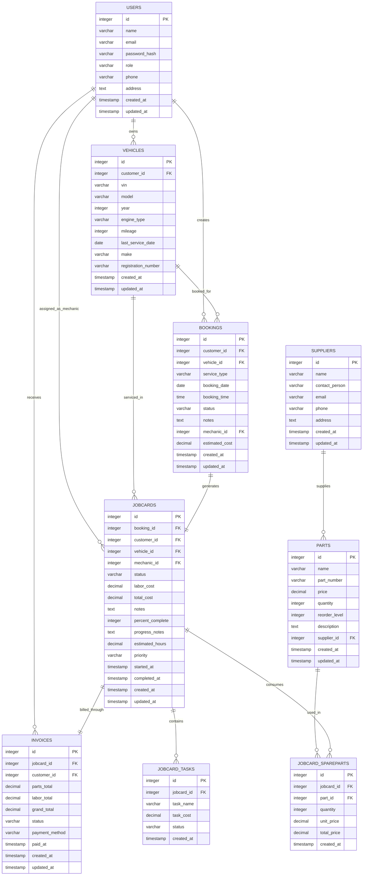

# SVMMS Database Schema Documentation

This document provides a comprehensive overview of the database schema for the Service Vehicle Management and Monitoring System (SVMMS). The system uses PostgreSQL as its database engine with a well-structured relational schema.

## Entity Relationship Diagram



## Database Tables

### 1. Users Table

Stores information about all system users including customers, mechanics, and administrators.

**Schema:**
```sql
CREATE TABLE users (
    id SERIAL PRIMARY KEY,
    name VARCHAR(255) NOT NULL,
    email VARCHAR(255) UNIQUE NOT NULL,
    password_hash VARCHAR(255) NOT NULL,
    role VARCHAR(50) NOT NULL CHECK (role IN ('customer', 'mechanic', 'admin')),
    phone VARCHAR(20),
    address TEXT,
    created_at TIMESTAMP DEFAULT CURRENT_TIMESTAMP,
    updated_at TIMESTAMP DEFAULT CURRENT_TIMESTAMP
);
```

**Attributes:**
- `id`: Unique identifier for each user (Primary Key)
- `name`: Full name of the user
- `email`: Email address (unique)
- `password_hash`: Hashed password for authentication
- `role`: User role (customer, mechanic, or admin)
- `phone`: Contact phone number
- `address`: Physical address
- `created_at`: Timestamp when record was created
- `updated_at`: Timestamp when record was last updated

**Indexes:**
- `idx_users_email`: Index on email for faster lookups
- `idx_users_role`: Index on role for role-based queries

### 2. Vehicles Table

Stores information about vehicles registered in the system, linked to their owners (customers).

**Schema:**
```sql
CREATE TABLE vehicles (
    id SERIAL PRIMARY KEY,
    customer_id INTEGER NOT NULL REFERENCES users(id) ON DELETE CASCADE,
    vin VARCHAR(17) UNIQUE NOT NULL,
    model VARCHAR(255) NOT NULL,
    year INTEGER NOT NULL,
    engine_type VARCHAR(100),
    mileage INTEGER DEFAULT 0,
    last_service_date DATE,
    make VARCHAR(255),
    registration_number VARCHAR(50),
    created_at TIMESTAMP DEFAULT CURRENT_TIMESTAMP,
    updated_at TIMESTAMP DEFAULT CURRENT_TIMESTAMP
);
```

**Attributes:**
- `id`: Unique identifier for each vehicle (Primary Key)
- `customer_id`: Foreign key linking to the owner (User)
- `vin`: Vehicle Identification Number (unique)
- `model`: Vehicle model name
- `year`: Manufacturing year
- `engine_type`: Type of engine
- `mileage`: Current odometer reading
- `last_service_date`: Date of last service
- `make`: Vehicle manufacturer
- `registration_number`: License plate number
- `created_at`: Timestamp when record was created
- `updated_at`: Timestamp when record was last updated

**Indexes:**
- `idx_vehicles_customer`: Index on customer_id for faster customer lookups
- `idx_vehicles_vin`: Index on VIN for faster vehicle identification
- `idx_vehicles_make_model`: Composite index on make and model
- `idx_vehicles_year`: Index on manufacturing year

### 3. Bookings Table

Stores service booking requests from customers for their vehicles.

**Schema:**
```sql
CREATE TABLE bookings (
    id SERIAL PRIMARY KEY,
    customer_id INTEGER NOT NULL REFERENCES users(id) ON DELETE CASCADE,
    vehicle_id INTEGER NOT NULL REFERENCES vehicles(id) ON DELETE CASCADE,
    service_type VARCHAR(255) NOT NULL,
    booking_date DATE NOT NULL,
    booking_time TIME NOT NULL,
    status VARCHAR(50) NOT NULL DEFAULT 'pending' CHECK (status IN ('pending', 'approved', 'confirmed', 'assigned', 'in_progress', 'completed', 'cancelled', 'rejected')),
    notes TEXT,
    mechanic_id INTEGER REFERENCES users(id) ON DELETE SET NULL,
    estimated_cost DECIMAL(10, 2) DEFAULT 0,
    created_at TIMESTAMP DEFAULT CURRENT_TIMESTAMP,
    updated_at TIMESTAMP DEFAULT CURRENT_TIMESTAMP
);
```

**Attributes:**
- `id`: Unique identifier for each booking (Primary Key)
- `customer_id`: Foreign key linking to the customer who made the booking
- `vehicle_id`: Foreign key linking to the vehicle being serviced
- `service_type`: Type of service requested
- `booking_date`: Date of the requested service
- `booking_time`: Time of the requested service
- `status`: Current status of the booking
- `notes`: Additional information or special requests
- `mechanic_id`: Foreign key linking to the assigned mechanic
- `estimated_cost`: Estimated cost for the service
- `created_at`: Timestamp when record was created
- `updated_at`: Timestamp when record was last updated

**Indexes:**
- `idx_bookings_customer`: Index on customer_id
- `idx_bookings_status`: Index on status
- `idx_bookings_date`: Index on booking_date
- `idx_bookings_vehicle`: Index on vehicle_id
- `idx_bookings_created_at`: Index on creation timestamp
- `idx_bookings_customer_status`: Composite index on customer_id and status
- `idx_bookings_date_status`: Composite index on booking_date and status
- `idx_bookings_mechanic`: Index on mechanic_id

### 4. Parts Table

Stores inventory information for spare parts used in vehicle servicing.

**Schema:**
```sql
CREATE TABLE parts (
    id SERIAL PRIMARY KEY,
    name VARCHAR(255) NOT NULL,
    part_number VARCHAR(100) UNIQUE,
    price DECIMAL(10, 2) NOT NULL,
    quantity INTEGER NOT NULL DEFAULT 0,
    reorder_level INTEGER NOT NULL DEFAULT 10,
    description TEXT,
    supplier_id INTEGER REFERENCES suppliers(id) ON DELETE SET NULL,
    created_at TIMESTAMP DEFAULT CURRENT_TIMESTAMP,
    updated_at TIMESTAMP DEFAULT CURRENT_TIMESTAMP
);
```

**Attributes:**
- `id`: Unique identifier for each part (Primary Key)
- `name`: Name of the part
- `part_number`: Manufacturer's part number (unique)
- `price`: Unit price of the part
- `quantity`: Current stock quantity
- `reorder_level`: Minimum stock level that triggers reordering
- `description`: Detailed description of the part
- `supplier_id`: Foreign key linking to the supplier
- `created_at`: Timestamp when record was created
- `updated_at`: Timestamp when record was last updated

**Indexes:**
- `idx_parts_quantity`: Index on quantity for stock level queries
- `idx_parts_name`: Index on part name
- `idx_parts_part_number`: Index on part number
- `idx_parts_price`: Index on price
- `idx_parts_reorder_level`: Index on reorder level
- `idx_parts_supplier`: Index on supplier_id

### 5. Suppliers Table

Stores information about parts suppliers.

**Schema:**
```sql
CREATE TABLE suppliers (
    id SERIAL PRIMARY KEY,
    name VARCHAR(255) NOT NULL,
    contact_person VARCHAR(255),
    email VARCHAR(255),
    phone VARCHAR(20),
    address TEXT,
    created_at TIMESTAMP DEFAULT CURRENT_TIMESTAMP,
    updated_at TIMESTAMP DEFAULT CURRENT_TIMESTAMP
);
```

**Attributes:**
- `id`: Unique identifier for each supplier (Primary Key)
- `name`: Company name of the supplier
- `contact_person`: Name of the primary contact person
- `email`: Contact email address
- `phone`: Contact phone number
- `address`: Physical address
- `created_at`: Timestamp when record was created
- `updated_at`: Timestamp when record was last updated

**Indexes:**
- `idx_suppliers_name`: Index on supplier name

### 6. Job Cards Table

Stores detailed information about work performed on vehicles, linked to bookings.

**Schema:**
```sql
CREATE TABLE jobcards (
    id SERIAL PRIMARY KEY,
    booking_id INTEGER REFERENCES bookings(id) ON DELETE SET NULL,
    customer_id INTEGER REFERENCES users(id) ON DELETE CASCADE,
    vehicle_id INTEGER NOT NULL REFERENCES vehicles(id) ON DELETE CASCADE,
    mechanic_id INTEGER REFERENCES users(id) ON DELETE SET NULL,
    status VARCHAR(50) NOT NULL DEFAULT 'pending' CHECK (status IN ('pending', 'assigned', 'in_progress', 'completed', 'cancelled')),
    labor_cost DECIMAL(10, 2) DEFAULT 0,
    total_cost DECIMAL(10, 2) DEFAULT 0,
    notes TEXT,
    percent_complete INTEGER DEFAULT 0 CHECK (percent_complete >= 0 AND percent_complete <= 100),
    progress_notes TEXT,
    estimated_hours DECIMAL(5, 2),
    priority VARCHAR(10) DEFAULT 'medium' CHECK (priority IN ('low', 'medium', 'high')),
    started_at TIMESTAMP,
    completed_at TIMESTAMP,
    created_at TIMESTAMP DEFAULT CURRENT_TIMESTAMP,
    updated_at TIMESTAMP DEFAULT CURRENT_TIMESTAMP
);
```

**Attributes:**
- `id`: Unique identifier for each job card (Primary Key)
- `booking_id`: Foreign key linking to the originating booking
- `customer_id`: Foreign key linking to the customer
- `vehicle_id`: Foreign key linking to the vehicle being serviced
- `mechanic_id`: Foreign key linking to the assigned mechanic
- `status`: Current status of the job
- `labor_cost`: Cost of labor for this job
- `total_cost`: Total cost of the job (parts + labor)
- `notes`: General notes about the job
- `percent_complete`: Percentage completion of the job
- `progress_notes`: Notes on work progress
- `estimated_hours`: Estimated hours required to complete the job
- `priority`: Priority level of the job (low, medium, high)
- `started_at`: Timestamp when work began
- `completed_at`: Timestamp when work was completed
- `created_at`: Timestamp when record was created
- `updated_at`: Timestamp when record was last updated

**Indexes:**
- `idx_jobcards_customer`: Index on customer_id
- `idx_jobcards_mechanic`: Index on mechanic_id
- `idx_jobcards_status`: Index on status
- `idx_jobcards_booking`: Index on booking_id
- `idx_jobcards_vehicle`: Index on vehicle_id
- `idx_jobcards_created_at`: Index on creation timestamp
- `idx_jobcards_completed_at`: Index on completion timestamp
- `idx_jobcards_mechanic_status`: Composite index on mechanic_id and status
- `idx_jobcards_vehicle_status`: Composite index on vehicle_id and status

### 7. Job Card Tasks Table

Stores individual tasks that make up a job card.

**Schema:**
```sql
CREATE TABLE jobcard_tasks (
    id SERIAL PRIMARY KEY,
    jobcard_id INTEGER NOT NULL REFERENCES jobcards(id) ON DELETE CASCADE,
    task_name VARCHAR(255) NOT NULL,
    task_cost DECIMAL(10, 2) NOT NULL,
    status VARCHAR(50) DEFAULT 'pending' CHECK (status IN ('pending', 'completed')),
    created_at TIMESTAMP DEFAULT CURRENT_TIMESTAMP
);
```

**Attributes:**
- `id`: Unique identifier for each task (Primary Key)
- `jobcard_id`: Foreign key linking to the parent job card
- `task_name`: Name/description of the task
- `task_cost`: Cost associated with this task
- `status`: Current status of the task
- `created_at`: Timestamp when record was created

**Indexes:**
- `idx_jobcard_tasks_jobcard`: Index on jobcard_id for faster task lookups

### 8. Job Card Spare Parts Table

Tracks spare parts used in job cards.

**Schema:**
```sql
CREATE TABLE jobcard_spareparts (
    id SERIAL PRIMARY KEY,
    jobcard_id INTEGER NOT NULL REFERENCES jobcards(id) ON DELETE CASCADE,
    part_id INTEGER NOT NULL REFERENCES parts(id) ON DELETE CASCADE,
    quantity INTEGER NOT NULL,
    unit_price DECIMAL(10, 2) NOT NULL,
    total_price DECIMAL(10, 2) NOT NULL,
    created_at TIMESTAMP DEFAULT CURRENT_TIMESTAMP
);
```

**Attributes:**
- `id`: Unique identifier for each spare part usage record (Primary Key)
- `jobcard_id`: Foreign key linking to the parent job card
- `part_id`: Foreign key linking to the part used
- `quantity`: Quantity of parts used
- `unit_price`: Price per unit at time of use
- `total_price`: Total cost for this part usage (quantity × unit_price)
- `created_at`: Timestamp when record was created

**Indexes:**
- `idx_jobcard_spareparts_jobcard`: Index on jobcard_id
- `idx_jobcard_spareparts_part`: Index on part_id

### 9. Invoices Table

Stores billing information for completed jobs.

**Schema:**
```sql
CREATE TABLE invoices (
    id SERIAL PRIMARY KEY,
    jobcard_id INTEGER NOT NULL REFERENCES jobcards(id) ON DELETE CASCADE,
    customer_id INTEGER NOT NULL REFERENCES users(id) ON DELETE CASCADE,
    parts_total DECIMAL(10, 2) DEFAULT 0,
    labor_total DECIMAL(10, 2) DEFAULT 0,
    grand_total DECIMAL(10, 2) NOT NULL,
    status VARCHAR(50) DEFAULT 'unpaid' CHECK (status IN ('unpaid', 'paid', 'cancelled')),
    payment_method VARCHAR(50),
    paid_at TIMESTAMP,
    created_at TIMESTAMP DEFAULT CURRENT_TIMESTAMP,
    updated_at TIMESTAMP DEFAULT CURRENT_TIMESTAMP
);
```

**Attributes:**
- `id`: Unique identifier for each invoice (Primary Key)
- `jobcard_id`: Foreign key linking to the job card being invoiced
- `customer_id`: Foreign key linking to the customer being billed
- `parts_total`: Total cost of parts used
- `labor_total`: Total cost of labor
- `grand_total`: Total amount due (parts + labor)
- `status`: Payment status of the invoice
- `payment_method`: Method used for payment
- `paid_at`: Timestamp when payment was received
- `created_at`: Timestamp when record was created
- `updated_at`: Timestamp when record was last updated

**Indexes:**
- `idx_invoices_customer`: Index on customer_id
- `idx_invoices_status`: Index on status
- `idx_invoices_jobcard`: Index on jobcard_id
- `idx_invoices_created_at`: Index on creation timestamp
- `idx_invoices_paid_at`: Index on payment timestamp
- `idx_invoices_customer_created`: Composite index on customer_id and created_at
- `idx_invoices_status_created`: Composite index on status and created_at

### 10. Migrations Table

Tracks which database migrations have been applied.

**Schema:**
```sql
CREATE TABLE migrations (
    id SERIAL PRIMARY KEY,
    name VARCHAR(255) UNIQUE NOT NULL,
    executed_at TIMESTAMP DEFAULT CURRENT_TIMESTAMP
);
```

**Attributes:**
- `id`: Unique identifier for each migration record (Primary Key)
- `name`: Name of the migration
- `executed_at`: Timestamp when the migration was executed

## Relationships Summary

1. **Users ↔ Vehicles**: One-to-Many (One user can own many vehicles)
2. **Users ↔ Bookings**: One-to-Many (One user can create many bookings)
3. **Users ↔ Job Cards**: One-to-Many (One mechanic can be assigned to many job cards)
4. **Users ↔ Invoices**: One-to-Many (One user can receive many invoices)
5. **Vehicles ↔ Bookings**: One-to-Many (One vehicle can have many bookings)
6. **Vehicles ↔ Job Cards**: One-to-Many (One vehicle can have many job cards)
7. **Bookings ↔ Job Cards**: One-to-One (One booking generates one job card)
8. **Job Cards ↔ Invoices**: One-to-One (One job card generates one invoice)
9. **Parts ↔ Job Card Spare Parts**: One-to-Many (One part can be used in many job cards)
10. **Job Cards ↔ Job Card Tasks**: One-to-Many (One job card can contain many tasks)
11. **Job Cards ↔ Job Card Spare Parts**: One-to-Many (One job card can consume many parts)
12. **Suppliers ↔ Parts**: One-to-Many (One supplier can supply many parts)

## Business Rules

1. **Cascade Deletes**: When a user is deleted, all their vehicles, bookings, invoices, and job cards are automatically deleted.
2. **VIN Uniqueness**: Each vehicle must have a unique VIN.
3. **Part Number Uniqueness**: Each part must have a unique part number.
4. **Status Constraints**: All status fields are constrained to predefined values to ensure data integrity.
5. **Percentage Validation**: Percent complete values are constrained between 0 and 100.
6. **Priority Levels**: Job card priorities are constrained to 'low', 'medium', or 'high'.
7. **Role Restrictions**: User roles are constrained to 'customer', 'mechanic', or 'admin'.

## Performance Optimizations

1. **Indexing Strategy**: Comprehensive indexing on foreign keys and commonly queried columns.
2. **Composite Indexes**: Strategic composite indexes for common query patterns.
3. **Data Types**: Appropriate data types chosen for optimal storage and performance.
4. **Constraints**: Database-level constraints to ensure data integrity and reduce application-level validation.

This schema provides a solid foundation for the SVMMS application, supporting all core functionalities including user management, vehicle tracking, service booking, job management, parts inventory, and billing.